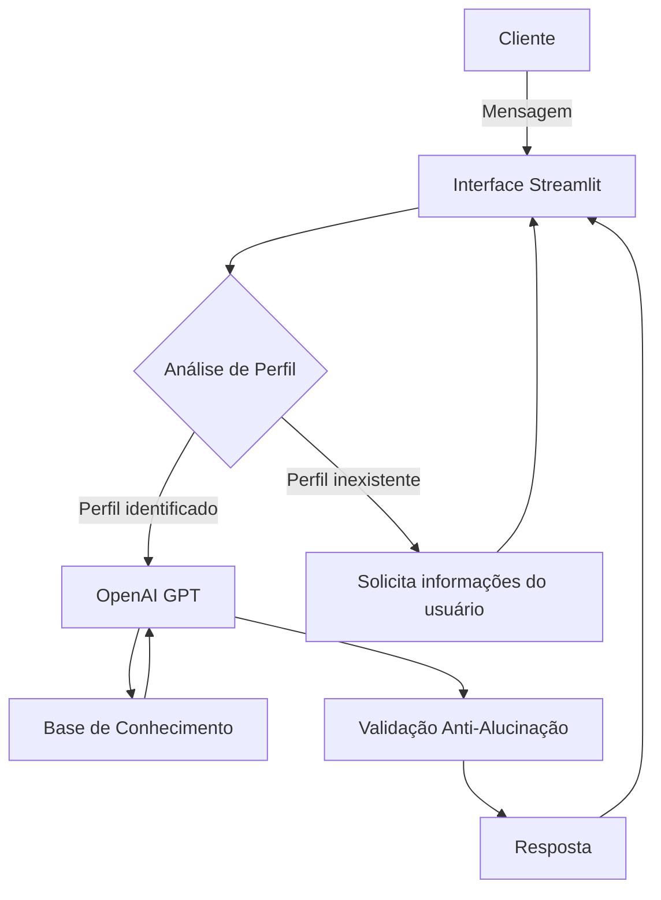

# 🏦 Ezio - Especialista Inteligente em Investimentos

> Agente de IA Generativa que auxilia usuários na organização financeira e na tomada de decisões sobre investimentos, oferecendo explicações claras, personalizadas e fundamentadas nos dados disponíveis.

## 💡 O que é o Ezio?

O **Ezio** é um agente inteligente especializado em **investimentos e educação financeira**. Seu objetivo é orientar o usuário por meio de uma abordagem consultiva e educativa, analisando seu perfil de investidor e seu histórico financeiro antes de apresentar sugestões compatíveis com sua realidade.

Diferentemente de um chatbot genérico, o Ezio utiliza uma base de conhecimento estruturada para explicar o raciocínio por trás de cada resposta, evitando recomendações incompatíveis com o perfil do cliente e reduzindo o risco de alucinações.

**O que o Ezio faz:**
- ✅ Analisa o perfil do investidor antes de qualquer recomendação;
- ✅ Explica conceitos financeiros de forma simples e acessível;
- ✅ Compara produtos financeiros disponíveis na base de conhecimento;
- ✅ Analisa padrões de gastos e hábitos financeiros;
- ✅ Utiliza o histórico do cliente para contextualizar as respostas;
- ✅ Explica o motivo por trás de cada sugestão apresentada.

**O que o Ezio NÃO faz:**
- ❌ Não executa compras, vendas ou transferências financeiras;
- ❌ Não garante rentabilidade futura;
- ❌ Não recomenda investimentos sem conhecer o perfil do investidor;
- ❌ Não inventa informações fora da Base de Conhecimento;
- ❌ Não fornece aconselhamento tributário, jurídico ou contábil;
- ❌ Não responde perguntas que estejam fora do seu domínio de atuação.

---

# 🏗️ Arquitetura



### Stack utilizada

- **Interface:** Streamlit
- **LLM:** OpenAI GPT (via API oficial)
- **Linguagem:** Python
- **Base de Dados:** Arquivos JSON e CSV mockados
- **Gerenciamento de Configuração:** dotenv (.env)

---

# 📁 Estrutura do Projeto

```text
.
├── assets/
│   ├── README.md
│   └── RoteiroLab.md
│
├── data/
│   ├── historico_atendimento.csv
│   ├── perfil_investidor.json
│   ├── produtos_financeiros.json
│   └── transacoes.csv
│
├── docs/
│   ├── 01-documentacao-agente.md
│   ├── 02-base-conhecimento.md
│   ├── 03-prompts.md
│   ├── 04-metricas.md
│   └── 05-pitch.md
│
├── examples/
│   └── README.md
│
├── src/
│   ├── agente.py
│   ├── app.py
│   ├── config.py
│   ├── requirements.txt
│   └── README.md
│
├── .env
├── .gitignore
├── LICENSE
└── README.md
```

---

# 🚀 Como Executar

## 1. Clone o repositório

```bash
git clone https://github.com/theonlyrafael/ezio-ai-investment-assistant
```

---

## 2. Configure a API da OpenAI

Crie um arquivo `.env` na raiz do projeto contendo sua chave da OpenAI:

```text
OPENAI_API_KEY=sua-chave-aqui
```

> **Importante:** mantenha o arquivo `.env` listado no `.gitignore` para evitar o vazamento da chave.

---

## 3. Instale as dependências

```bash
pip install -r src/requirements.txt
```

---

## 4. Execute a aplicação

```bash
streamlit run src/app.py
```

Após iniciar, o Streamlit abrirá automaticamente a interface do Ezio no navegador.

---

# 🎯 Exemplos de Uso

### Pergunta

> Quero começar a investir. O que você recomenda?

**Ezio**

> Antes de indicar qualquer investimento, preciso entender o seu perfil. Você prefere aplicações com maior segurança, mesmo rendendo um pouco menos, ou aceita oscilações em busca de maiores retornos?

---

### Pergunta

> Minha reserva de emergência já está pronta. O que faço agora?

**Ezio**

> Como seu perfil é moderado e sua reserva já está completa, faz sentido começar uma diversificação gradual. Posso apresentar algumas alternativas compatíveis com o seu perfil e explicar as diferenças entre elas.

---

### Pergunta

> Onde estou gastando mais dinheiro?

**Ezio**

> Analisando seu histórico financeiro, posso identificar quais categorias concentram a maior parte das suas despesas e explicar como isso pode impactar sua capacidade de investimento.

---

### Pergunta

> Qual será o tempo amanhã?

**Ezio**

> 😅 Meu foco é ajudar você a cuidar dos seus investimentos. Não tenho acesso à previsão do tempo, mas ficarei feliz em esclarecer qualquer dúvida sobre finanças ou investimentos.

---

# 🛡️ Segurança

O Ezio foi desenvolvido para minimizar respostas incorretas e reduzir alucinações.

Ele segue algumas regras fundamentais:

- Utiliza apenas informações presentes na Base de Conhecimento;
- Nunca promete lucros ou rentabilidades futuras;
- Solicita o perfil do investidor antes de recomendar qualquer produto;
- Admite quando uma informação está fora do seu escopo;
- Explica conceitos utilizando linguagem simples e exemplos práticos.

---

# 📊 Métricas de Avaliação

| Métrica | Objetivo |
|---------|----------|
| **Assertividade** | Responder corretamente às perguntas do usuário utilizando apenas informações disponíveis. |
| **Segurança** | Evitar invenção de dados e admitir limitações quando necessário. |
| **Coerência** | Apresentar respostas compatíveis com o perfil financeiro do cliente. |
| **Aderência ao Perfil** | Garantir que produtos sugeridos respeitem o nível de risco do investidor. |
| **Fuga de Escopo** | Recusar educadamente perguntas que não sejam relacionadas ao domínio financeiro. |

---

# 📚 Documentação

Toda a documentação do projeto encontra-se na pasta **docs/**:

- **01-documentacao-agente.md** — Persona, arquitetura, limitações e segurança;
- **02-base-conhecimento.md** — Estratégia de integração da base de dados;
- **03-prompts.md** — Prompt do sistema, regras e exemplos de interação;
- **04-metricas.md** — Critérios de avaliação e resultados dos testes;
- **05-pitch.md** — Apresentação do projeto.

---

# 📸 Evidência de Execução

